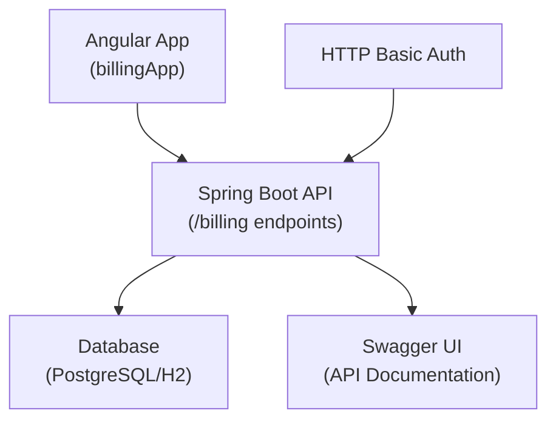

# devops_udemy

Este repositorio `marpinas/devops_ci` implementa un sistema de facturación completo con dos componentes principales: un backend de API REST en Spring Boot y una aplicación frontend en Angular.

## Backend - Servicio de Facturación

El backend es una aplicación Spring Boot que proporciona una API REST para gestionar facturas. [1](#0-0) 

### Funcionalidades principales:
- **API REST completa**: Operaciones CRUD para facturas a través de `InvoiceRestController` [2](#0-1) 
- **Seguridad**: Autenticación HTTP Basic con usuarios predefinidos [3](#0-2) 
- **Documentación API**: Swagger integrado para documentar los endpoints [4](#0-3) 
- **Base de datos**: Soporte para PostgreSQL y H2 [5](#0-4) 

## Frontend - Aplicación Angular

El frontend es una aplicación Angular que proporciona una interfaz de usuario para crear y visualizar facturas. [6](#0-5) 

### Características de la UI:
- **Formulario de creación**: Permite ingresar datos de facturas (número, cliente, detalle, monto) [7](#0-6) 
- **Lista de facturas**: Tabla que muestra todas las facturas creadas [8](#0-7) 
- **Diseño responsivo**: Utiliza Bootstrap para el styling

## Arquitectura del Sistema

El sistema está diseñado como una aplicación de microservicios con separación clara entre frontend y backend, autenticación de seguridad, y documentación automática de la API.

**Notes**

El repositorio incluye configuración para DevOps con archivos de pruebas automatizadas y configuración de linting para TypeScript. La aplicación backend utiliza Spring Security con CORS habilitado para permitir comunicación con el frontend Angular.

Wiki pages you might want to explore:
- [User Interface (marpinas/devops_ci)](/wiki/marpinas/devops_ci#2.2)
